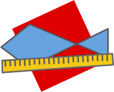

fish-mesh
=========
Measure fish (or other things) from a photo using a reference box with known dimensions.

Dependencies
------------
* python >= 3.8

standard python library packages:
* [tkinter](https://docs.python.org/3/library/tk.html)

External packages:
* [numpy](https://numpy.org/)
* [OpenCV](https://docs.opencv.org/4.5.3/)
* [Pillow](https://python-pillow.org/)
* [pyinstaller](https://github.com/pyinstaller/pyinstaller)
* [exif](https://gitlab.com/TNThieding/exif)
* [pandas](https://pandas.pydata.org/docs/)
  and [openpyxl](https://openpyxl.readthedocs.io/en/stable/) (write excel files)

Setup:
------
* [Ubuntu](readmes/setup-ubuntu.md)
* [MacOS](readmes/setup-macos.md)
* [Windows](readmes/setup-windows.md)
